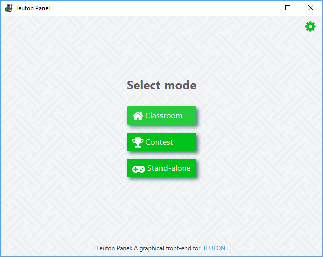

# Teuton Panel

Graphical front-end for [TEUTON](https://github.com/dvarrui/teuton).



## For users

Download the right installer for your platform from [releases](https://github.com/teuton-software/teuton-panel/releases), and install the app.

## For developers

Requirements for building `teuton-panel`:

* [**OpenJDK**](https://adoptopenjdk.net/) (11+)
* [**Maven**](https://maven.apache.org) (3.5.4+)
* [**Inno Setup**](http://www.jrsoftware.org/isinfo.php) (5+): *to build EXE installer on Windows*

### How to build the application 

Execute next commands in BASH (GNU/Linux) or CMD (Windows):

1. Download source code and change to the project directory:

```bash
git clone https://github.com/teuton-software/teuton-panel.git
cd teuton-panel
```

2. Download gems:

```bash
mvn gem:initialize
```

3. Compile and package the project:

```bash
mvn package
```

It generates in `target`:

* A `teuton-panel_x.y.z.deb` package file on GNU/Linux. 
* A `teuton-panel_x.y.z.rpm` package file on GNU/Linux.
* A `teuton-panel_x.y.z.exe` installer file on Windows.
* A `teuton-panel_x.y.z.dmg` installer file on Mac OS X.

## Contributors

Thanks to the following contributors, who have provided patches and other assistance:

* **Javier Valencia Rodríguez**